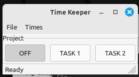

# timekeeper
A small GUI that tracks time spent on a project. Very much half-baked and tailored to my specific needs. 

Click a button that corresponds to the project that you are currently working on. When you are done, click OFF or a different project. The time that the button spends depressed is recorded in 1-minute intervals. The time summarys are reported to the 15-minute mark, with extra time added to the next day. 

The project was designed to be stored on Dropbox or similar, so that you can boot from multiple computers. This is why the code and data live together. 

Todo: 
* make interface to add or remove tasks. This is currently done with manual edits to settings
* find out if anyone finds this useful.
